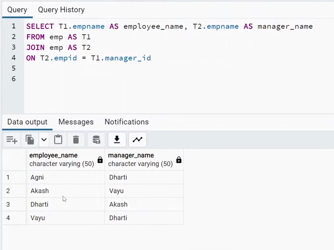

# `#NUMBERING:`

- 01 -> My sql with xampp
- 02 -> Edge Class University database
- 03 -> Some datatype 
- 04 -> Join in Sql
- 05 -> Aggeregate Function
- 06 -> Group By and Having
- 07 -> Self Join, Union and Union all
- 08 -> Sub Query
- 09 -> Windows Function:
- 10 -> Case Expression

<br>

# `#01 My sql with xmapp:`

<br>

Start the xmapp server and start Mysql database and Apache Web Server.
- we can change the port by clicking configure option.

# [installation_blog](https://sharafat.is-a.dev/notes/mysql/)

<br>


<br>

# `#02 Edge class: university database:`

<br>

intrigity constant,

- ON DELETE CASCADE vs ON DELETE SET NULL,

    [ON_DELETE_CASCADE_VS_ON_DLETE_SET_NULL_Blog_LINK](https://www.geeksforgeeks.org/difference-between-on-delete-cascade-and-on-delete-set-null-in-dbms/)

<br>
<br>


##
### প্রাইমারি মেমোরি (Primary Memory):  
1. **সংজ্ঞা:** প্রাইমারি মেমোরি হল কম্পিউটারের ভেতরের মেমোরি যা ডেটা এবং প্রোগ্রামগুলিকে অস্থায়ীভাবে সংরক্ষণ করে।  
2. **গতি:** এটি খুব দ্রুত কাজ করে।  
3. **ধারণক্ষমতা:** প্রাইমারি মেমোরির স্টোরেজ সীমিত হয় (যেমন, RAM 4GB, 8GB ইত্যাদি)।  
4. **ধরন:** প্রধানত দুটি -  
   - RAM (Random Access Memory)  
   - ROM (Read-Only Memory)  
5. **ডেটা স্থায়িত্ব:** RAM-এর ডেটা কম্পিউটার বন্ধ হলে মুছে যায়।  
6. **মূল্য:** এটি তুলনামূলকভাবে দামি।  
7. **ব্যবহার:** ডেটা এবং প্রোগ্রামকে প্রসেস করার সময় তা দ্রুত অ্যাক্সেসের জন্য ব্যবহৃত হয়।  

### সেকেন্ডারি মেমোরি (Secondary Memory):  
1. **সংজ্ঞা:** সেকেন্ডারি মেমোরি হল কম্পিউটারের বাইরের মেমোরি যা ডেটা এবং ফাইলকে স্থায়ীভাবে সংরক্ষণ করে।  
2. **গতি:** এটি তুলনামূলকভাবে ধীর।  
3. **ধারণক্ষমতা:** সেকেন্ডারি মেমোরি সাধারণত বড় স্টোরেজ ধারণক্ষমতা রাখে (যেমন, হার্ড ড্রাইভ 1TB, 2TB ইত্যাদি)।  
4. **ধরন:** কিছু উদাহরণ -  
   - HDD (Hard Disk Drive)  
   - SSD (Solid State Drive)  
   - USB Drives  
   - Optical Disks (CD/DVD)  
5. **ডেটা স্থায়িত্ব:** সেকেন্ডারি মেমোরিতে ডেটা স্থায়ী থাকে, কম্পিউটার বন্ধ হলেও তা থাকে।  
6. **মূল্য:** এটি তুলনামূলকভাবে সস্তা।  
7. **ব্যবহার:** দীর্ঘমেয়াদি ডেটা সংরক্ষণ এবং ব্যাকআপের জন্য ব্যবহৃত হয়।  

**সংক্ষেপে:**  
- **প্রাইমারি মেমোরি** দ্রুত এবং অস্থায়ী, প্রসেসিংয়ের জন্য।  
- **সেকেন্ডারি মেমোরি** ধীর কিন্তু স্থায়ী, ডেটা সংরক্ষণের জন্য।  

<br>
<br>


## `Work With University database:`


**Database Schema:**

```sql
create table classroom
	(building		varchar(15),
	 room_number		varchar(7),
	 capacity		numeric(4,0),
	 primary key (building, room_number)
	);

create table department
	(dept_name		varchar(20), 
	 building		varchar(15), 
	 budget		    numeric(12,2) check (budget > 0),
	 primary key (dept_name)
	);

create table course
	(course_id		varchar(8), 
	 title			varchar(50), 
	 dept_name		varchar(20),
	 credits		numeric(2,0) check (credits > 0),
	 primary key (course_id),
	 foreign key (dept_name) references department (dept_name)
		on delete set null
	);

create table instructor
	(ID			varchar(5), 
	 name			varchar(20) not null, 
	 dept_name		varchar(20), 
	 salary			numeric(8,2) check (salary > 29000),
	 primary key (ID),
	 foreign key (dept_name) references department (dept_name)
		on delete set null
	);

create table section
	(course_id		varchar(8), 
         sec_id			varchar(8),
	 semester		varchar(6)
		check (semester in ('Fall', 'Winter', 'Spring', 'Summer')), 
	 year			numeric(4,0) check (year > 1701 and year < 2100), 
	 building		varchar(15),
	 room_number		varchar(7),
	 time_slot_id		varchar(4),
	 primary key (course_id, sec_id, semester, year),
	 foreign key (course_id) references course (course_id)
		on delete cascade,
	 foreign key (building, room_number) references classroom (building, room_number)
		on delete set null
	);

create table teaches
	(ID			varchar(5), 
	 course_id		varchar(8),
	 sec_id			varchar(8), 
	 semester		varchar(6),
	 year			numeric(4,0),
	 primary key (ID, course_id, sec_id, semester, year),
	 foreign key (course_id, sec_id, semester, year) references section (course_id, sec_id, semester, year)
		on delete cascade,
	 foreign key (ID) references instructor (ID)
		on delete cascade
	);

create table student
	(ID			varchar(5), 
	 name			varchar(20) not null, 
	 dept_name		varchar(20), 
	 tot_cred		numeric(3,0) check (tot_cred >= 0),
	 primary key (ID),
	 foreign key (dept_name) references department (dept_name)
		on delete set null
	);

create table takes
	(ID			varchar(5), 
	 course_id		varchar(8),
	 sec_id			varchar(8), 
	 semester		varchar(6),
	 year			numeric(4,0),
	 grade		        varchar(2),
	 primary key (ID, course_id, sec_id, semester, year),
	 foreign key (course_id, sec_id, semester, year) references section (course_id, sec_id, semester, year)
		on delete cascade,
	 foreign key (ID) references student (ID)
		on delete cascade
	);

create table advisor
	(s_ID			varchar(5),
	 i_ID			varchar(5),
	 primary key (s_ID),
	 foreign key (i_ID) references instructor (ID)
		on delete set null,
	 foreign key (s_ID) references student (ID)
		on delete cascade
	);

create table time_slot
	(time_slot_id		varchar(4),
	 day			varchar(1),
	 start_hr		numeric(2) check (start_hr >= 0 and start_hr < 24),
	 start_min		numeric(2) check (start_min >= 0 and start_min < 60),
	 end_hr			numeric(2) check (end_hr >= 0 and end_hr < 24),
	 end_min		numeric(2) check (end_min >= 0 and end_min < 60),
	 primary key (time_slot_id, day, start_hr, start_min)
	);

create table prereq
	(course_id		varchar(8), 
	 prereq_id		varchar(8),
	 primary key (course_id, prereq_id),
	 foreign key (course_id) references course (course_id)
		on delete cascade,
	 foreign key (prereq_id) references course (course_id)
	);
```

- char(5): `memory size always fix.`
- varchar(5) : `vary the memory size. "ab" -> it takes memory for two character from primary memory.`

<br>

# `#03 Some Datatype in Sql;`

<br>

### **`# NUMERIC(12,2)`**:
1. **সংজ্ঞা:**  
   - `NUMERIC(12,2)` এর অর্থ হলো:  
     - মোট **১২টি সংখ্যা** (ডিজিট) সংরক্ষণ করা যাবে।  
     - এর মধ্যে **২টি সংখ্যা দশমিক পয়েন্টের পরে থাকবে**।  
     - বাকিরা (১২ - ২ = ১০) দশমিক পয়েন্টের আগে থাকবে।  
   - উদাহরণ:  
     - সঠিক ইনপুট: `1234567890.12`, `0.99`, `99999.01`  
     - ভুল ইনপুট: `12345678901.12` (১২ ডিজিটের সীমা অতিক্রম করেছে), `12.123` (দশমিকের পরে ৩ সংখ্যা আছে)।  


### **`# CHECK (budget > 0)`**:
1. **সংজ্ঞা:**  
   - এই শর্তটি নিশ্চিত করে যে **`budget` কলামের মান ০ এর চেয়ে বড় হতে হবে**।  
   - অর্থাৎ, আপনি কোনো নেতিবাচক (negative) বা শূন্য (0) মান ইনসার্ট করতে পারবেন না।  
   - উদাহরণ:  
     - সঠিক ইনপুট: `1000.00`, `12.34`, `1.01`  
     - ভুল ইনপুট: `-500.00`, `0`, `-0.01`  


### **আপনার স্টেটমেন্টের কাজের নিয়ম**:
1. **নেতিবাচক মান (negative value):**  
   - `CHECK (budget > 0)` এর কারণে নেতিবাচক মান বা `0` ইনসার্ট করা যাবে না।  

2. **দশমিক পয়েন্টের সংখ্যা:**  
   - `NUMERIC(12,2)` এর কারণে দশমিকের পরে **শুধুমাত্র ২টি সংখ্যা** ইনসার্ট করা যাবে।  

3. **সীমা:**  
   - দশমিকসহ সর্বাধিক ১২টি সংখ্যা ইনসার্ট করা যাবে।  


### **`# ON DELETE SET NULL`:**  
- যখন প্যারেন্ট টেবিল থেকে একটি রেকর্ড মুছে ফেলা হয়, তখন চাইল্ড টেবিলের সংশ্লিষ্ট **ফরেন কি** মান **NULL** হয়ে যায়।  
- উদাহরণ:  
  প্যারেন্ট টেবিল থেকে `dept_id` মুছে ফেললে চাইল্ড টেবিলে `dept_id` **NULL** হবে।  


### **`# ON DELETE CASCADE`:**  
- যখন প্যারেন্ট টেবিল থেকে একটি রেকর্ড মুছে ফেলা হয়, তখন চাইল্ড টেবিলের সংশ্লিষ্ট **রেকর্ডও মুছে যায়**।  
- উদাহরণ:  
  প্যারেন্ট টেবিল থেকে `dept_id` মুছে ফেললে চাইল্ড টেবিলের সেই `dept_id` থাকা রেকর্ড **ডিলিট** হবে।  


**সংক্ষেপে:**  
- `SET NULL` -> ফরেন কি NULL হয়।  
- `CASCADE` -> চাইল্ড রেকর্ডও মুছে যায়।  


- Show all the tables:
    ```sql
    show tables;
    ```
- Show all the tables with metadata:

```sql
decscribe table_name

```

<br>

#  `# 04 Join in SQL`

<br>

JOIN দিয়ে আমরা দুই বা ততোধিক table এর output কে  combine করতে পারি । কিন্তু, condition হচ্ছে, এদের মধ্যে common, column থাকতে হবে  থাকতে হবে ।

**Types of join:**
- Inner join
- Left join
- Right join
- Full Outer join 
<br>


<br>

# `# Inner Join:`


এই উদাহরণে, `inner_join(x, y)` অপারেশনটি দুটি টেবিল বা ডেটা সেট `x` এবং `y` কে তাদের কমন কলামের ভিত্তিতে join করছে। `inner_join` শুধুমাত্র সেই রেকর্ডগুলো রিটার্ন করে যেগুলো উভয় টেবিলে ম্যাচ করে।

### ডেটা সেট `x` এবং `y`:
- `x` টেবিলে কলাম: `id`, `value_x`
- `y` টেবিলে কলাম: `id`, `value_y`

ডেটা সেট `x`:
```
id | value_x
1  | x1
2  | x2
3  | x3
```

ডেটা সেট `y`:
```
id | value_y
1  | y1
2  | y2
4  | y4
```

### `inner_join(x, y)` এর আউটপুট:
```
id | value_x | value_y
1  | x1      | y1
2  | x2      | y2
```

### ব্যাখ্যা:
- `id` 1 এবং 2 উভয় টেবিল `x` এবং `y` তে উপস্থিত আছে। তাই, এই রেকর্ডগুলো `inner_join` এর আউটপুটে দেখানো হয়েছে।
- `id` 3 শুধুমাত্র `x` টেবিলে আছে এবং `id` 4 শুধুমাত্র `y` টেবিলে আছে। যেহেতু এই `id` গুলো উভয় টেবিলে ম্যাচ করে না, তাই এগুলো `inner_join` এর আউটপুটে দেখানো হয়নি।

এইভাবে, `inner_join` শুধুমাত্র সেই রেকর্ডগুলো রিটার্ন করে যেগুলো উভয় টেবিলে কমন কলামের ভিত্তিতে ম্যাচ করে।


Syntax:
```sql
SELECT column_name
FROM TableA
INNER JOIN TableB
ON TABLE.col_Name = TABLE.col_name
```
`দুই ক্ষেত্রেই TABLE.col_Name সেম হতে হবে । `


**Example:** 

```sql
SELECT * 
FROM customer AS c
INNER JOIN paymnet AS p
ON c.customer_id = p.customer_id
```

# `# LEFT JOIN, RIGHT JOIN, FULL OUTTER JOIN`


<br>

**revise all:**


# `# 05 Aggregate Function:`


<br>

# `# 06 Group By and Having:`

<br>

### Group By:

** `Aggregate function use করলে আমাদের GROUP BY ব্যবহার করতেই হবে । না হলে error আসবে ।`**


এখানে, mode এ  Cash, Credit Card, Debit Card সহ নানা মাধ্যম ব্যবহার করেছে । এখন, ব্যবহার করে কত টাকা পয়সা আদান প্রধান করা হয়েছে,  যদি সেইটা জানতে চায় তাহলে আমরা, Aggegate function এর পাশাপাশি group by clause ব্যবহার করতেই হবে । 


**with order by:**

```sql
SELECT mode, SUM(amount)  AS total
FROM payment 
GROUP BY mode
ORDER BY total ASC
```

### Having:

`SELECT এর সাথে CONDITION যোগ করার জন্য আমরা Where ব্যবহার করতাম আর group by এর সাথে কোন CONDITION যোগ করার জন্য আমরা Having ব্যবহার করবো । group by এর পর Having ব্যবহার করবো, যদি আগে করি তাহলে error দিবে । `

Let's see an example,

Without implement having clause,


With having clause single condition,


With having clause multiple condition,


Visulization: 


<br>
<br>

# `# 7. Self Join, UNION and UNION ALL`

আমরা যখন, একই table এর দুইটা column এর মধ্যে তুলনা করতে চাই তখন আমাদের self join দরকার হয় । 

**Syntax:**
```sql
SELECT column_name(s)
FROM Table AS T1
JOIN Table AS T2 
ON T1.col_name = T2.col_name
```

### Read the question from the image:


**ANSWER:** <br>


But i need only the manager name of my employee:



### UNION:

দুইটা  table combine/concatenate করার জন্য । Union করার ফলে আমরা unique recoards পাই ।  যেখানে, কোন logic implement করা লাগে না । Union implement করার জন্য আমাদের কিছু মাথায় রাখতে হবেঃ

- Same number of columns and data type and same order

### UNION ALL 

Same to same UNION কিন্ত, আমরা এখানে, duplicate value পায় । 

### Example Question:
`Use UNION and UNION ALL:`


**ANS:** we got 4 rows because UNION Does not allow duplicate value.


**ANS:** we got 5 rows because UNION ALL operation allow duplicate value.


<br>
<br>

# `#08 Sub-Query:`

<br>
<br>

কোন query করলে আমরা তার যে output পাবো, তারউপর আবার query করা হলে, প্রথমে যে  query করেছিলাম তাকে আমরা subquery বলি । 

**Syntax:**

```sql 
SELECT column_name(s)
FROM  table_name
WHERE column_name operator
(SELECT column_name FROM table_name)
```

**Question:**


i) Find  the average value:
```sql
select avg(amount) from payment
```
**output: 164**

ii) finter the custom data > avg. value

```sql
SELECT * 
FROM payment
where amount>164
```
উপরের apporach এ ans করালে সেইটা static হবে । dynamic হবে না । তাই, যে query ব্যবহার করে 164 পেয়েছি সেইটা (first bracket) দিয়ে query টা দিব । 

**Final Ans:**
```sql
SELECT * 
FROM payment
where amount > (select avg(amount) from payment)
```

### `*উপরে sub-query এর result এ একটা value (164) পেয়েছি । যদি  এখানে, multiple vlaue পেতাম তাহলে কীভাবে query করতাম????*`

**ANS:** আমরা আগের বার comparasion operator ব্যবহার  করেছি । এখন, আমরা logical operator **IN, Exists** ব্যবহার করবো । 

<br>

With IN:


<br>

With Exists:


<br>


<br>
<br>

# `# 09 Windows Function in SQL:`

<br>
<br>


<br>
<br>

## 01: Aggeregate Function:
### Partition by and Order by: `(We do partition here)`


### Rows clause: `(We don't do partition here)`


## 02: Ranking Function: 


## 03: Analytic function:


### LEAD,LAG BY a particular number:


<br>
<br>

# `# 10 CASE EXPRESSION:`

<br>
<br>

**Case Expression:** The case expression goes through conditions and return a value when the first condition is met(like if-then-else statement). If no conditions are true, it returns the value in the ELSE clause.

If  there is no ELSE part and no conditins are true, it returns NULL.

<br>

**General Case Statement:**
```sql 
CASE
    WHEN condition1 THEN result1
    WHEN condition2 THEN result1
    WHEN condition3 THEN result1
    ELSE other_result
END;
```
**Example:**
```sql
SELECT customer_id, amount,
    CASE
        WHEN amount > 100 THEN 'Expensive product'
        WHEN amount = 100 THEN 'MOderate product'
        ELSE 'Inexpensive product'
    END AS ProductStatus 
    FROM payment;
```


<br>


## **General Case Expression:**

```sql 
CASE Expression
    WHEN value1 THEN result1
    WHEN value2 THEN result1
    WHEN value3 THEN result1
    ELSE other_result
END;
```
**Example:**
```sql
SELECT customer_id,
    CASE amount
        WHEN 500 THEN 'Prime Customer'
        WHEN 100 THEN 'Plus Customer'
        ELSE 'Regular Customer'
    END AS ProductStatus 
    FROM payment;
```

<br>


<br>
<br>
<br>

# `# CTE: Common Table Expression:`

<br>
<br>
<br>

## `Common Table Expression(CTE):`

- A common table expression, or CTE, is a temporary named result set created from a simple SELECT statement that can be used in a subsequent SELECT statement.

- We can define CTEs by adding a WITH clause directly before SELECT, INSERT, UPDATE, DELETE or MERGE statement.

- The WITH clause can include one or more CTES statement by commas.

**Syntax:**
```sql
--- CTEs Query:
WITH my_cte AS(
    SELECT a,b,c 
    FROM Table1)

--- Main Query:
Select a,c FROM my_cte 
```
**payment table:** <br>


**customer table:** <br>


**all the result save in a temporary table name: my_cte:**


`যদি আলাদা করে my_cte run করি হবে না কারণ, এইটা with clause এর সাথে ।`


## we can write multiple CTEs command:


# `# Question:`
SELECT,FROM,WHERE,GROUP BY,HAVING,ORDER BY,LIMIT list down the exection order.

**ANSWER:** FROM → WHERE → GROUP BY → HAVING → SELECT → ORDER BY → LIMIT


