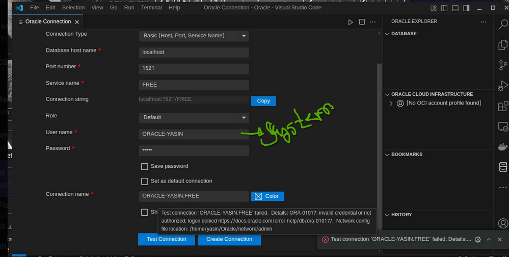

<br>

# `Oracle Download with Podman in arch linux: `

<br>


[downlaod_link_blog](https://sharafat.is-a.dev/notes/oracle-db/)


<br>
<br>

# `# Connection with VsCode: `

### 1. Download the extension below: 

[extention_Oracle_Vscode](https://marketplace.visualstudio.com/items?itemName=Oracle.sql-developer)



<br>
<br>

---
---

<br>

---
---

<br>

# `Basic Command:`

<br>

# `1. **Oracle-এ ডাটাবেস এবং টেবিল তৈরি করার প্রক্রিয়া:**`  

Oracle-এ সরাসরি একটি ডাটাবেস তৈরি করা যায় না যেভাবে MySQL-এ করা যায়। Oracle-এ "ডাটাবেস" বলতে একটি সম্পূর্ণ **Instance** বোঝায়। তবে, আপনি একটি **User Schema** তৈরি করতে পারেন এবং তাতে টেবিল তৈরি করতে পারেন।  

---

### **১. একটি নতুন ইউজার (Schema) তৈরি করুন:**
```sql
CREATE USER my_database IDENTIFIED BY my_password;
```

### **২. ইউজারকে Privileges দিন:**
```sql
GRANT CONNECT, RESOURCE TO my_database;
```

### **৩. নতুন ইউজারে লগ ইন করুন:**
```sql
CONNECT my_database/my_password;
```

---

### **৪. টেবিল তৈরি করুন:**
```sql
CREATE TABLE my_table (
    id NUMBER(5),
    name VARCHAR2(50)
);
```

এখন আপনি এই Schema-তে যত ইচ্ছা টেবিল তৈরি করতে পারেন। 


**To see all Oracle database instances created on a computer, you can use the following methods:**

```sql
SELECT instance_name FROM v$instance;
```

---
---

<br>


